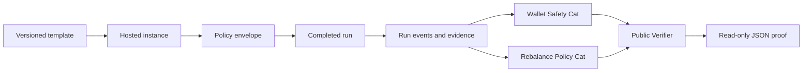
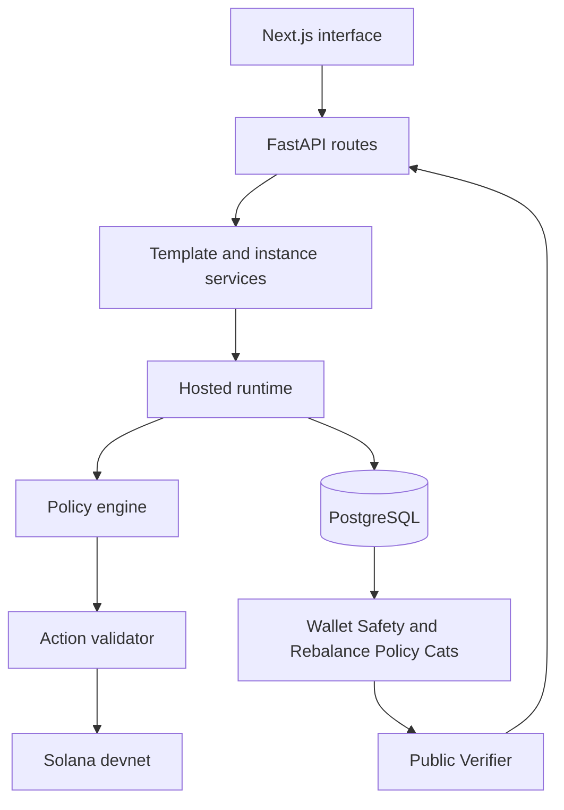

<div align="center">

# Proof Arena

### Verify a Solana agent run before you rely on it.

Proof Arena verifies completed hosted Solana agent runs. It applies fixed checks and returns one read-only JSON proof document that another person or system can inspect.

**[Quick proof](#proof-that-it-works) · [How it works](#how-it-works) · [API routes](#api-routes) · [Run locally](#run-proof-arena-locally) · [Honest limits](#honest-limits)**


</div>

Proof Arena records what an agent was allowed to do, what happened during one run, and which checks passed after the run ended.

The current product has two check groups: Wallet Safety and Rebalance Policy. A Public Verifier combines their results with run details, instance and template origin, evidence details, and event totals.

The result is made for inspection. The verifier cannot change the run that it checks, and it lists every public response field by hand.

---

## The problem

An agent can report that it followed a policy (a set of rules that says what it can and cannot do). That report is not enough when the agent can also produce or change the result used to judge it.

A useful record must answer direct questions:

- Which policy and template applied to this run?
- Which actions were proposed and accepted?
- Did the run target Solana devnet or mainnet?
- Did wallet or authorization checks fail?
- Does the saved evidence match its recorded hash?
- Can another system inspect the result without private data?

Proof Arena gives one answer per completed run. It uses fixed code for the result and saved evidence for support.

## Who Proof Arena is for

| Reader | What Proof Arena provides |
| --- | --- |
| Agent developers | A repeatable way to test wallet, policy, and evidence behavior for each completed run. |
| Protocols and wallets | A read-only result that can support an integration or allowlist decision. |
| Product teams | A stable API for proof cards, reports, and repeated-run summaries. |
| Reviewers | Test commands, fixed check IDs, evidence hashes, and clear product limits. |

Proof Arena does not require a public competition or leaderboard to verify one run.

## What you can do

- **Deploy a hosted instance.** Start from a versioned template and save the instance configuration, template origin, trust label, and policy envelope.
- **Run under fixed limits.** The runner checks proposed actions before execution and records run events and evidence.
- **Check the completed run.** Wallet Safety and Rebalance Policy return named pass or fail results.
- **Fetch one proof document.** The Public Verifier returns the run, its origin, evidence details, event totals, and Cat results.
- **Re-run the same checks.** The same stored input and code version produce the same result.

## How it works



### 1. Deploy

A deployment stores the template and version used by the instance. It also stores a trust label and the policy limits that apply to the hosted run.

### 2. Run

The runner observes state, requests an action, checks the action, and executes it only when the action is valid. It records each stage as a run event.

### 3. Check

After the run ends, each supported Cat applies its own fixed rules. A Cat cannot write to the run or change the saved evidence.

### 4. Prove

The Public Verifier returns one document with the run, its instance and template origin, evidence details, event totals, and Cat results.

## Proof Arena terms

- **Run:** One recorded execution of an agent.
- **Hosted run:** A run executed by the Proof Arena runtime.
- **Policy:** A set of rules that says what an agent can and cannot do during a run.
- **Policy envelope:** Stored limits for allowed tokens, slippage, position size, iteration count, and run time.
- **Cat:** A named group of fixed checks for one risk area. Cat is short for Category.
- **Evidence:** Saved records that support a result, such as hashes, events, transaction records, and verification files.
- **Public Verifier:** The read-only API that combines run details, origin, evidence details, event totals, and Cat results.
- **Deterministic:** The same stored input and code version produce the same result.
- **Trust label:** A stored label that controls who may read a proof document.
- **Devnet:** Solana's test network. It does not use real Solana mainnet assets.

## What works now

### Policy and action checks

The active hosted path is devnet-only. The policy engine rejects a non-devnet chain before it builds a wallet policy.

The wallet policy denies actions unless a rule allows them. It stores the token, slippage, position, iteration, and run-time limits for the instance.

The runner checks every proposed action before execution. An invalid action is recorded but not executed.

### Wallet Safety Cat

Wallet Safety checks a completed hosted run. It has ten stable check IDs:

1. `envelope_slippage_check`
2. `envelope_token_universe_check`
3. `envelope_position_size_check`
4. `envelope_runtime_seconds_check`
5. `envelope_iterations_check`
6. `mainnet_guard_check`
7. `wallet_policy_check`
8. `authorization_signature_check`
9. `hosted_wallet_available_check`
10. `invalid_action_attempts_check`

Wallet Safety does not recalculate all ten rules from raw events. It reads the saved run failure reason and maps one of five wallet failures to the related failed check.

| Saved failure reason | Failed check |
| --- | --- |
| `mainnet_guard_triggered` | `mainnet_guard_check` |
| `wallet_policy_rejected` | `wallet_policy_check` |
| `authorization_signature_rejected` | `authorization_signature_check` |
| `hosted_wallet_unavailable` | `hosted_wallet_available_check` |
| `invalid_action_attempts_exceeded` | `invalid_action_attempts_check` |

If the run failed for another reason, Wallet Safety reports that the failure is outside its scope. Another Cat can handle that reason.

### Rebalance Policy Cat

Rebalance Policy supports completed `rebalance_executor_v1` runs. It recalculates ten rules from the deployed configuration and a content-hashed `rebalance_evidence_v1` file.

| Check | What it verifies |
| --- | --- |
| `target_allocation_sum_check` | Target weights total 1.0 within the allowed tolerance. |
| `allowed_token_universe_check` | Every target token is in the allowed token list. |
| `price_data_present_check` | Every portfolio token has saved price data. |
| `rebalance_threshold_check` | The threshold and planned rebalance agree with the recorded drift. |
| `max_trade_value_check` | No planned trade exceeds the value limit. |
| `max_position_weight_check` | No target position exceeds its weight limit. |
| `max_slippage_check` | Slippage settings and dry-run results stay inside their limits. |
| `dry_run_or_devnet_check` | The V0 run stayed in its dry-run and hosted-run limits. |
| `post_trade_allocation_drift_check` | A V0 dry run did not claim a changed final allocation. |
| `rebalance_evidence_present_check` | The required evidence exists and its content hash matches. |

The Cat returns all ten check results. Its first failed check supplies the fixed explanation.

### Public Verifier

The Public Verifier always includes Wallet Safety. It also includes Rebalance Policy for a supported rebalance run.

It returns four main blocks:

- `run`: public run fields and version fields;
- `lineage`: the instance and template origin;
- `evidence`: the run-log hash, event total, final event details, and verification-file metadata;
- `cats`: the Wallet Safety result and the optional Rebalance Policy result.

The verifier lists each public field in a hand-written Pydantic schema. It does not convert database rows directly into public responses.

### Product services

- FastAPI provides template, instance, run, Cat, verifier, challenge, and leaderboard routes.
- PostgreSQL stores templates, instances, runs, events, and verification files.
- Docker Compose starts PostgreSQL, the backend, and the Next.js interface.
- The Next.js interface includes template, deployment, instance, challenge, and leaderboard pages.
- The Rust Anchor program remains V1 foundation code. It is not the active proof-storage path.

## Example proof document

This shortened example shows the response shape. Private configuration, wallet references, event payloads, and raw verification-file locations are not public fields.

```json
{
  "verifier_version": "v0",
  "run": {
    "run_id": 42,
    "status": "completed",
    "completion_status": "complete",
    "provider_type": "hosted_instance",
    "run_log_hash": "3c91..."
  },
  "lineage": {
    "instance_id": 9,
    "trust_label": "benchmarked_canonical_template",
    "template": {
      "template_key": "swap_executor_v1",
      "template_version": "1.0.0",
      "template_version_at_deploy": "1.0.0"
    }
  },
  "evidence": {
    "run_log_hash": "3c91...",
    "run_event_count": 12,
    "last_event_sequence_no": 12,
    "last_event_type": "finalize",
    "verification_artifacts": []
  },
  "cats": {
    "wallet_safety": {
      "result": "pass",
      "reason": null,
      "checks": []
    },
    "rebalance_policy": null
  }
}
```

`lineage` is the API field for the instance and template origin. `rebalance_policy` is `null` when the run does not use the supported rebalance template.

## How Proof Arena is different

Proof Arena checks one completed Solana run. It is not a general model dashboard, an identity registry, or a competition requirement.

| Product type | Main question | Difference from Proof Arena |
| --- | --- | --- |
| Model monitoring | What happened during model calls? | Proof Arena checks a completed Solana run against fixed policy and evidence rules. |
| Agent identity or reputation | Who is this agent? | Proof Arena checks what happened in one recorded run. |
| Agent competition | Which agent performed best? | Proof Arena can verify a run without a public competition or leaderboard. |

[Respan](https://www.respan.ai/docs/documentation/overview) documents model tracing, evaluations, prompt management, and model routing.

[Recall](https://docs.recall.network/reference/competitions) documents agent competitions, paper trading, and leaderboards.

These products can be complementary. Proof Arena's current boundary is a fixed result over one completed hosted Solana run.

## Proof that it works

The fastest proof path runs without Docker, Solana RPC, Privy, AgentOS, or a model provider.

From `backend/`:

```bash
uv sync

# Wallet Safety, Public Verifier, and failure-reason contract
uv run pytest \
  tests/integration/test_wallet_safety_cat.py \
  tests/integration/test_verifier_v0.py \
  tests/test_task_a6_failure_taxonomy.py \
  -q
# 56 passed

# Rebalance Policy and verifier composition
uv run pytest \
  tests/integration/test_rebalance_policy_cat.py \
  tests/integration/test_rebalance_policy_cat_route.py \
  tests/integration/test_verifier_with_rebalance_cat.py \
  tests/test_rebalance_cat_no_llm_imports.py \
  -q
# 29 passed
```

| Claim | Proof |
| --- | --- |
| Wallet failure mapping and ten check IDs | `backend/tests/integration/test_wallet_safety_cat.py` |
| Read-only verifier and private-field absence | `backend/tests/integration/test_verifier_v0.py` |
| Fixed failure-reason set | `backend/tests/test_task_a6_failure_taxonomy.py` |
| Ten Rebalance Policy checks | `backend/tests/integration/test_rebalance_policy_cat.py` |
| Rebalance route and authorization behavior | `backend/tests/integration/test_rebalance_policy_cat_route.py` |
| Rebalance result in the Public Verifier | `backend/tests/integration/test_verifier_with_rebalance_cat.py` |
| No model-library imports in the Rebalance Cat path | `backend/tests/test_rebalance_cat_no_llm_imports.py` |

The repository has more tests for policy validation, action checks, runtime behavior, templates, instances, wallets, database changes, and the V1 Anchor program.

## Architecture

The V2 and V2.1 path is the active hosted-run and verification product. The V1 challenge and Anchor code remains foundation code.



### Active V2 and V2.1 path

- `backend/src/services/` manages templates, instances, wallets, runs, and other application operations.
- `backend/src/runtime/` contains the hosted-runtime boundary.
- `backend/src/policy/` validates the policy envelope and creates the wallet policy.
- `backend/src/integrity/action_validator.py` checks actions before execution.
- `backend/src/integrity/cats/` checks completed runs.
- `backend/src/integrity/verifier/` builds the public proof document.
- `backend/src/db/` stores the data model and database setup.

### V1 foundation

`programs/agent_arena/` contains the Rust Anchor program for the earlier challenge, settlement, and rank flow.

This program supplied useful run and evidence concepts. It is not the current Public Verifier and does not anchor the current proof document on-chain.

## Run Proof Arena locally

### Requirements

- Python 3.12 and [uv](https://docs.astral.sh/uv/).
- Docker and Docker Compose for the PostgreSQL and HTTP smoke path.
- Node.js 20 or later for the optional Next.js interface.
- Rust, Solana CLI, and Anchor 0.32.1 only for V1 Anchor work.

The backend package accepts Python 3.11 or later. The supplied Docker image uses Python 3.12.

### Quick test path

```bash
git clone https://github.com/degencodebeast/proof-arena.git
cd proof-arena/backend
uv sync
uv run pytest \
  tests/integration/test_wallet_safety_cat.py \
  tests/integration/test_verifier_v0.py \
  tests/test_task_a6_failure_taxonomy.py \
  -q
```

This path uses an in-memory SQLite database. It does not require Docker or a Solana key.

### PostgreSQL and HTTP smoke path

The supplied Compose file is a local demo. It is not a production deployment.

Set the key-file path to an existing Solana devnet keypair. The Cat and verifier smoke seed does not send a Solana transaction, but Docker must mount the configured file.

```bash
cd proof-arena

export PROOF_ARENA_TREASURY_KEYPAIR_HOST=/absolute/path/to/devnet-keypair.json
export PRIVY_APP_ID=local-smoke-unused
export PRIVY_APP_SECRET=local-smoke-unused
export NEXT_PUBLIC_PRIVY_APP_ID=local-smoke-unused

docker compose up --build -d
docker compose exec backend uv run alembic upgrade head
docker compose exec backend uv run python -m scripts.seed_v2_1_smoke_run
```

The seed prints a `run_id`. Use it in the three proof routes below.

### Optional web interface

```bash
cd frontend
npm ci
npm run dev
```

Open `http://localhost:3000`. The backend runs at `http://localhost:8000` in the Compose setup.

## API routes

All proof routes use the `/api/v1` prefix.

| Method | Route | Result |
| --- | --- | --- |
| `GET` | `/api/v1/cats/wallet_safety/{run_id}` | Wallet Safety result for a completed hosted run. |
| `GET` | `/api/v1/cats/rebalance_policy/{run_id}` | Rebalance Policy result for a supported rebalance run. |
| `GET` | `/api/v1/verifier/runs/{run_id}` | One proof document with the run, origin, evidence, event totals, and Cat results. |

Example:

```bash
RUN_ID=42

curl -s "http://localhost:8000/api/v1/cats/wallet_safety/${RUN_ID}" | jq .
curl -s "http://localhost:8000/api/v1/cats/rebalance_policy/${RUN_ID}" | jq .
curl -s "http://localhost:8000/api/v1/verifier/runs/${RUN_ID}" | jq .
```

### Read access

Read access uses the instance trust label:

- `benchmarked_canonical_template`: public read;
- `benchmark_compatible_customized_instance`: owner authorization required;
- `external_custom_runtime`: not supported by the current route.

## Security rules

These rules apply to the active hosted path:

1. **Devnet only.** The policy engine rejects a non-devnet chain.
2. **Deny by default.** A wallet action needs an allow rule.
3. **Check before execution.** The runner does not execute an invalid action.
4. **Read-only verification.** Cat and verifier routes do not write to the database.
5. **Explicit public fields.** Verifier response fields are listed by hand.
6. **Private fields stay absent.** Tests check both private field names and private sentinel values.
7. **Fixed check code.** The Cat and verifier route files do not import model libraries.
8. **Origin is not reputation.** An instance records its template origin but does not inherit the template's score.

The hosted runtime can use model libraries. The no-model rule applies only to the Cat and Public Verifier result path.

## Honest limits

- Proof Arena does not provide mainnet custody. The active hosted path is devnet-only.
- It does not store the Public Verifier proof document on-chain.
- It does not provide a public marketplace or cross-runtime certification.
- One passing run does not prove that future runs will be safe.
- Wallet Safety maps saved failure reasons. It does not replay every action from raw evidence.
- External runtimes are outside the current Cat and verifier support boundary.
- The Next.js interface is not required for the proof APIs and does not yet provide a complete public proof-card product.

The Rebalance Policy demo uses a priced test fixture. The current live runner records balances but does not yet record the required price evidence.

For a real V0 rebalance run, `price_data_present_check` will fail until the runtime records those prices. This is an evidence-capture gap, not a change to the Cat rule.

## Business direction

The current product is the open-source hosted-run verification core: policies, recorded evidence, two Cats, and one Public Verifier document.

Possible product forms are listed below. They are future directions, not shipped offers.

| Direction | Possible user |
| --- | --- |
| Proof-card interface | Agent teams that need to share one run result. |
| Repeated-run safety report | Teams that need a history of checks across many runs. |
| Partner proof API | Protocols and wallets that need machine-readable run checks. |
| Version comparison | Teams that need to compare policy, template, or runtime changes. |
| More Cats | Teams that need checks for settlement, evidence completeness, or another defined risk area. |

The product should expand only when each new Cat has fixed inputs, clear check IDs, saved evidence, tests, and honest limits.

## Technology

| Area | Technology |
| --- | --- |
| Backend | Python 3.12 in Docker, FastAPI, Pydantic v2, async SQLAlchemy 2, Alembic, uv |
| Data | PostgreSQL 16 for the local stack, SQLite for focused tests |
| Tests | pytest, pytest-asyncio, httpx ASGI transport |
| Hosted runtime | AgentOS boundary with Agno, OpenAI, and Anthropic support outside the Cat and verifier path |
| Wallet and authorization | Privy, P-256 authorization signatures, JCS JSON canonicalization |
| Solana services | solders, solana-py, AnchorPy, Orca devnet path |
| Web interface | Next.js 16, React 19, strict TypeScript, Tailwind CSS, Privy auth |
| V1 program | Rust, Anchor 0.32.1, Solana devnet |

## Project structure

```text
proof-arena/
├── backend/
│   ├── src/
│   │   ├── api/                 FastAPI routes
│   │   ├── integrity/
│   │   │   ├── cats/            Wallet Safety and Rebalance Policy
│   │   │   └── verifier/        Public response builder and schemas
│   │   ├── policy/              Policy-envelope and wallet-policy rules
│   │   ├── runtime/             Hosted-runtime boundary
│   │   ├── services/            Application services
│   │   ├── providers/           Run providers
│   │   └── db/                  Models, sessions, and migrations
│   ├── scripts/                 Smoke seeds and operator scripts
│   └── tests/                   Unit and integration tests
├── frontend/                    Next.js interface
├── agentos_app/                 AgentOS application package
├── programs/agent_arena/        V1 Rust Anchor foundation
├── scripts/                     V1 demo and quickstart tools
├── docker-compose.yml           Local PostgreSQL, backend, and frontend
└── Anchor.toml                  V1 devnet program configuration
```

Behavior-sensitive V1 names such as `AgentRankAccount`, `update_agent_rank`, and the `agent_rank` seed remain unchanged for Solana compatibility.

## Detailed documents

| Document or source | Purpose |
| --- | --- |
| [`agentos_app/README.md`](agentos_app/README.md) | AgentOS application setup and boundaries. |
| [`backend/scripts/agentos_dry_run/README.md`](backend/scripts/agentos_dry_run/README.md) | Hosted-runtime dry-run checks. |
| [`backend/src/integrity/cats/wallet_safety.py`](backend/src/integrity/cats/wallet_safety.py) | Wallet Safety rules and failure mapping. |
| [`backend/src/integrity/cats/rebalance_policy.py`](backend/src/integrity/cats/rebalance_policy.py) | Rebalance Policy checks. |
| [`backend/src/integrity/verifier/schemas.py`](backend/src/integrity/verifier/schemas.py) | Public response fields. |
| [`backend/src/integrity/verifier/builder.py`](backend/src/integrity/verifier/builder.py) | Public proof document builder. |
| [`docs/superpowers/specs/2026-08-04-proof-arena-readme-design.md`](docs/superpowers/specs/2026-08-04-proof-arena-readme-design.md) | README rewrite design and claim rules. |

## License

The root package metadata declares the ISC license. The repository does not currently include a root `LICENSE` file.

Add a root license file before you rely on the package metadata for reuse or distribution terms.
